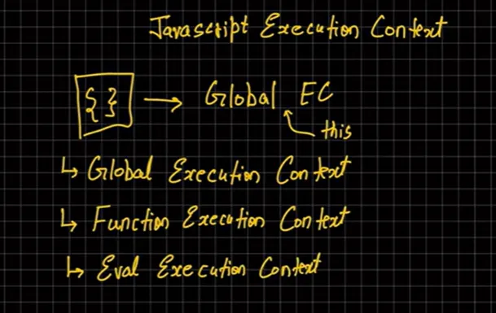
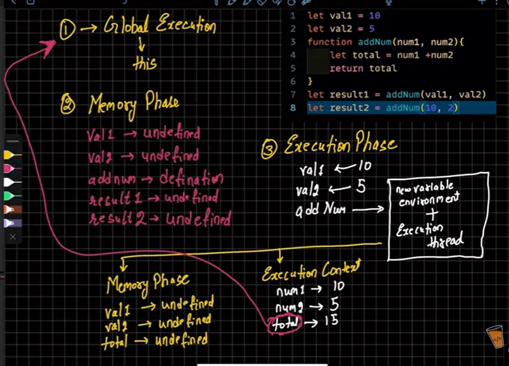
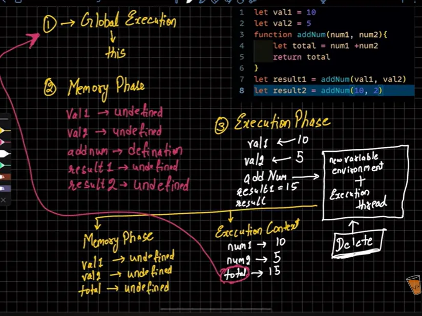

- call stack is a mechanism for an interpreter (like javascript) to keep track of its place in a script that calls multiple functions — what function is currently being run and what functions are called from within that function, etc.
- when a function is invoked, a new frame is created and pushed onto the call stack. This frame contains information about the function, such as its parameters and local variables. When the function completes, its frame is popped off the stack, and control is returned to the previous frame.

 --> for result1
  -- 
  
   --> for result2